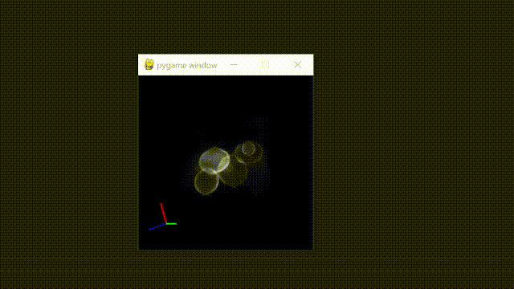
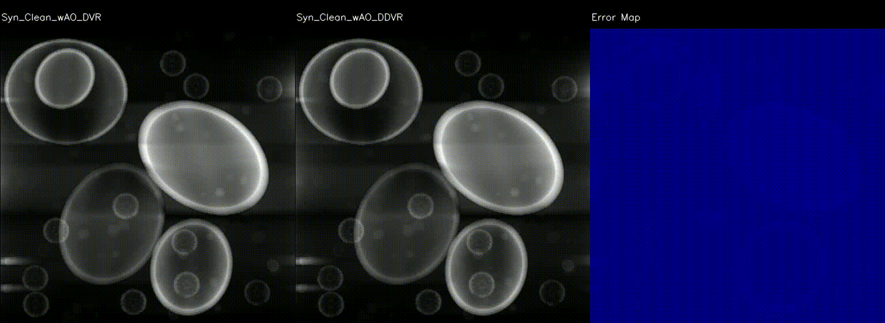

# Computational scientific Imaging

## repo structure

- D2VR folder contains the FBP CUDA version

- scripts folder contains the FBP+Volume render python implementation

## Dataset 

you can get dataset from [Clean Implicit 3D Structure from Noisy 2D STEM Images](https://github.com/HannahKniesel/Implicit-Electron-Tomography)

## Instruction for code running

- 1. You need to set the data path in the coresponding place in py_render.py

- 2. For the FBP CUDA version, you need to set the path in D2VR\scr\main.cu

## Some visual result

### Render UI
We implment the interaction UI based on pygame

### FBP reconstruction result

For the dataset, we used four dataset from  [Clean Implicit 3D Structure from Noisy 2D STEM Images](https://github.com/HannahKniesel/Implicit-Electron-Tomography)

1. Synthetic data with noise

2. Synthetic data without noise

3. Real nanoparticles

4. Read covid infected cell

### Some render result
This is one result showing the comparison between DVR and D2VR with AO

